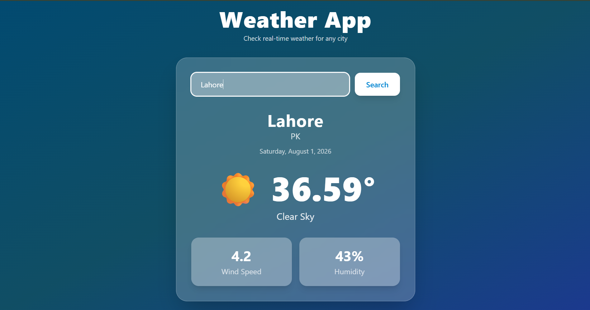

# 🌤️ Weather App

A modern and responsive **Weather Application** built with **React**, **Vite**, and **Tailwind CSS**. It fetches real-time weather information using the **OpenWeather API** and displays temperature, weather conditions, humidity, and wind speed for any city.

---

## 📸 Preview



### Features

- 🔍 Search weather by city name
- 🌡️ Real-time temperature (°C)
- ☁️ Weather condition with emoji
- 💧 Humidity information
- 🌬️ Wind speed
- 📅 Current date display
- ⏳ Loading spinner while fetching data
- ❌ Error handling for invalid city names
- 📱 Fully responsive UI
- 🎨 Glassmorphism design with Tailwind CSS

---

## 🛠️ Built With

- React
- Vite
- Tailwind CSS
- OpenWeather API

---

## 📂 Project Structure

```
weatherApp/
│
│
│
├── src/
    ├── Components/
    │   ├── Search.jsx
    │   └── Weather.jsx
    │
    ├── App.jsx
    ├── index.css
    └── main.jsx
```

---

## 🔑 OpenWeather API

This project uses the **OpenWeather API**.

Get your free API key from:

https://openweathermap.org/api

Replace the API key inside `Weather.jsx`:

```javascript
const response = await fetch(
  `https://api.openweathermap.org/data/2.5/weather?q=${param}&appid=YOUR_API_KEY&units=metric`,
);
```

---

## 📌 How It Works

1. User enters a city name.
2. Clicking the **Search** button or pressing **Enter** starts the search.
3. The app sends a request to the OpenWeather API.
4. Weather information is displayed on the screen.
5. If the city name is invalid, an error message appears.

---

## 📷 Weather Information Displayed

- City Name
- Country
- Current Date
- Temperature
- Weather Description
- Weather Emoji
- Humidity
- Wind Speed

---

## 💻 Components

### Search.jsx

Responsible for:

- Search input
- Enter key support
- Search button

### Weather.jsx

Responsible for:

- API requests
- State management
- Loading state
- Error handling
- Weather UI
- Default city weather

---

## 📱 Responsive Design

The application is responsive for:

- Mobile
- Tablet
- Laptop
- Desktop

---

## 🎨 UI Features

- Glassmorphism cards
- Gradient background
- Animated loading spinner
- Hover effects
- Responsive layout
- Smooth transitions

---

## ⚙️ Technologies Used

| Technology      | Purpose              |
| --------------- | -------------------- |
| React           | Frontend Framework   |
| Vite            | Build Tool           |
| Tailwind CSS    | Styling              |
| JavaScript      | Programming Language |
| OpenWeather API | Weather Data         |

---

## 🐞 Error Handling

The application handles:

- Invalid city names
- Empty search input
- Network errors
- API response errors

---
